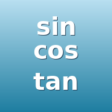

<div align="center">



# 三角函數計時比賽

**練習常見三角函數值的計時答題遊戲 — 可安裝 PWA、支援離線、含錯題本與音效**

> 🆕 **v3** 新增於 `v3/` 子目錄：混合模式改為複選象限，每場隨機抽 15 題

[](https://github.com/nekokiller/trigonometry)
[](https://github.com/nekokiller/trigonometry)
[](#授權)

🎮 **線上試玩 v2**：<https://nekokiller.github.io/trigonometry/>
🆕 **線上試玩 v3**：<https://nekokiller.github.io/trigonometry/v3/>

</div>

---

## 📖 簡介

這是一款練習常見三角函數值（sin / cos / tan）的計時答題網頁遊戲，採用 **PWA (Progressive Web App)** 設計，可加入手機主畫面後離線執行。

- 🎯 涵蓋常見 17 個角度（0° ~ 360° / 0 ~ 2π）
- 🧩 6 種題型 × 度／弧度兩種單位 × 計時開關
- ⏱️ 計時模式可開可關，挑戰個人最佳成績
- 🔊 答題正確 / 錯誤都有音效回饋
- 📚 **錯題本**：答錯的題目自動進入錯題本，學會後自動移除
- 📱 支援 iPhone 加入主畫面、完全離線執行

---

## ✨ 功能特色

### 🔢 雙單位選擇
- **單位：度**（例如 `sin 30°`、`cos 150°`）
- **單位：弧度**（例如 `sin π/6`、`cos 5π/6`）

### 📐 六種題型

| 題型 | 角度範圍 | 題數 |
|---|---|---|
| 第一象限角 | 30°, 45°, 60° | 9 |
| 第二象限角 | 120°, 135°, 150° | 9 |
| 第三象限角 | 210°, 225°, 240° | 9 |
| 第四象限角 | 300°, 315°, 330° | 9 |
| 象限角 | 0°, 90°, 180°, 270° | 12 |
| 混合 | 複選象限（Q1–Q4 + 象限角，可複選）→ 隨機抽 15 題 | 15 |

每個角度都會考 sin / cos / tan 三個函數。

### ⏱️ 計時模式（可開可關）
- **計時開**：計時器即時顯示經過時間（`分:秒.毫秒`），總結畫面顯示完成時間
- **計時關**：純練習模式，無壓力答題

### 🔊 答題音效
- 答對時播放正確音效（`audio/correct.mp3`，47 KB）
- 答錯時播放錯誤音效（`audio/wrong.mp3`，16 KB）
- 預設音量 70%
- iOS / Android 均可正常播放（屬於使用者手勢觸發，符合自動播放政策）

### 📚 錯題本（核心學習功能）

**自動累積，學會自動移除**：

- 答錯的題目會自動進入「錯題本」（跨場累積，永久保存）
- 同一題的「度」與「弧度」版本分開儲存
- 從首頁點 `📚 錯題本 (N)` 進入卡片式重答模式
- **答對後從錯題本自動移除**（不論是在錯題本中重答，還是在正常比賽中再次遇到並答對）
- 重答畫面會顯示「上次答案」（紅）與「正解」（綠），強化記憶
- 完成總結顯示「征服 X 題」+「剩 Y 題」+「再練剩下的」按鈕

### 🎮 答題體驗
- 隨機洗牌每場題目順序
- 答對閃綠 + 正確音效，答錯閃紅 + 錯誤音效並標示正解
- 280 ms 自動進下一題
- 完成後顯示總題數、答對率、總時間，並存入 localStorage

---

## 📱 在 iPhone 上安裝（PWA）

1. 用 **Safari**（不可使用 Chrome）開啟：
   <https://nekokiller.github.io/trigonometry/>
2. 點底部 **分享按鈕**（口字 + 箭頭往上）
3. 滾到下方選擇 **加入主畫面**
4. 主畫面會出現「三角函數」圖示
5. 點圖示開啟即可全螢幕使用，並支援**離線執行**（含音效）

### 在 Android 上安裝
1. 用 **Chrome** 開啟同樣的網址
2. 網址列右側會出現「安裝」按鈕，或點選右上角選單 → **安裝應用程式**

---

## 🛠️ 技術細節

| 項目 | 內容 |
|---|---|
| 前端 | 純 HTML / CSS / JavaScript（無框架、無打包工具） |
| PWA | `manifest.json` + Service Worker (Cache-First) |
| 離線快取 | `index.html`、`manifest.json`、2 個 icon、2 個音效 |
| 計時器 | `performance.now()` + `setInterval`（30 ms 更新） |
| 資料儲存 | `localStorage`（歷史成績 + 錯題本） |
| 音效播放 | HTML5 Audio (preload + currentTime reset) |
| 手機適配 | `100dvh`、`env(safe-area-inset-*)`、`viewport-fit=cover` |
| 字體描邊 | `-webkit-text-stroke` + `paint-order: stroke fill` |

### 檔案結構

```
v2/
├── index.html              # v2 主程式 (HTML + CSS + JS 單檔)
├── manifest.json           # PWA 設定檔
├── sw.js                   # Service Worker (離線快取)
├── icon-192.png            # 192×192 圖示
├── icon-512.png            # 512×512 圖示
├── audio/
│   ├── correct.mp3         # 答對音效 (47 KB)
│   └── wrong.mp3           # 答錯音效 (16 KB)
├── v3/                     # v3：混合複選象限
│   ├── index.html          # v3 主程式
│   ├── manifest.json
│   ├── sw.js
│   ├── icon-192.png
│   ├── icon-512.png
│   └── audio/
│       ├── correct.mp3
│       └── wrong.mp3
└── README.md               # 本檔案
```

### LocalStorage 資料

| Key | 用途 |
|---|---|
| `trig_quiz_history_v2` | v2 比賽歷史成績（最多 100 筆） |
| `trig_quiz_history_v3` | v3 比賽歷史成績（最多 100 筆） |
| `trig_quiz_wrong_v2` | 錯題本，v2 / v3 共用（依 `funcName_angleDeg_unit` 為 key） |

---

## 🎨 答案符號（14 種）

```
1, -1, √3, -√3, √3/2, -√3/2, √2/2, -√2/2,
1/2, -1/2, 1/√3, -1/√3, 0, 無意義
```

> 註：`tan 90°` 與 `tan 270°` 的答案為「無意義」

每個題型的答案網格會依該象限可能的答案動態調整：

| 題型 | 選項數 | 排版 |
|---|---|---|
| 第一象限 | 6 | 3 × 2 |
| 第二/三/四象限 | 13 | 3 × 5（0 居中於最後一列） |
| 象限角 | 4 | 2 × 2 |
| 混合（含象限角）/ 錯題本 | 14 | 4 × 4（0、無意義 居中於最後一列） |
| 混合（不含象限角） | 13 | 3 × 5（0 居中於最後一列） |

---

## 🧪 本機測試（開發者）

```bash
# clone 專案
git clone https://github.com/nekokiller/trigonometry.git
cd trigonometry

# 啟動本機 HTTP server (必要：Service Worker 必須透過 HTTP/HTTPS 才能啟用，不可用 file://)
python3 -m http.server 8000
# 或
npx serve -p 8000
```

開瀏覽器訪問 <http://localhost:8000>

> ⚠️ 透過 `file://` 直接開啟 `index.html` 仍可遊玩，但 Service Worker 不會註冊。

---

## 🔄 版本紀錄

| 版本 | 日期 | 內容 |
|---|---|---|
| **v3.0.20260529** | 2026-05-29 | **混合複選象限**：「混合」改為可複選 Q1–Q4 + 象限角，每場隨機抽 15 題；含象限角時答案自動升 14 個，否則固定 13 個 |
| **v2.0.20260526-wrongbook** | 2026-05-26 | **錯題本（跨場累積、卡片式重答、學會自動移除）** |
| v2.0.20260526-audio | 2026-05-26 | 加入答題正確 / 錯誤音效 |
| v2.0.20260526-PWA | 2026-05-26 | PWA 化 + GitHub Pages 部署（manifest / SW / icons） |
| v2.0.20260526 | 2026-05-26 | 計時開關 + 版本資訊 + 題目對齊修正 + 標題真實描邊 |
| v2.0 | 2026-05-26 | 兩組選項（單位 × 象限）、六種題型、動態答案網格 |
| v1.0 | 2026-05-26 | 首版（360° / 2π / 180° / π 四種模式） |

---

## 🚧 待開發

- [ ] 歷史記錄頁面 UI（資料已存於 localStorage）
- [ ] 錯題本進階：依錯誤次數排序、依模式 / 象限篩選
- [ ] 個人最佳成績徽章
- [ ] 完成時 Fanfare 音效
- [ ] 連續答對 combo 顯示
- [ ] 深色模式
- [ ] 多語言支援
- [ ] 答題回饋時間可調整

---

## 🤝 貢獻

歡迎開 Issue 提出改進建議或回報 bug。

如果這個專案對您的學習有幫助，請點個 ⭐ Star 鼓勵一下！

---

## 📄 授權

MIT License — 自由使用、修改、散布。

---

<div align="center">

**Made with ❤️ for Math Learners**

[回到頂端 ↑](#三角函數計時比賽)

</div>
